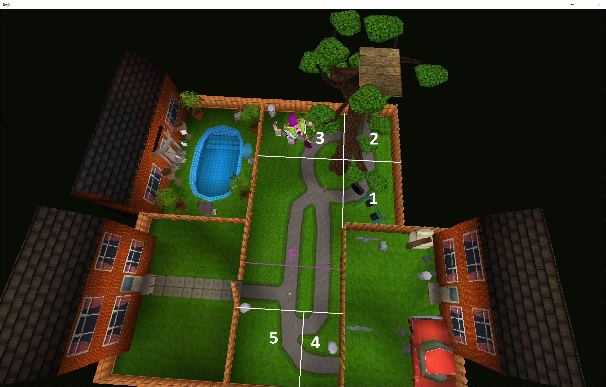
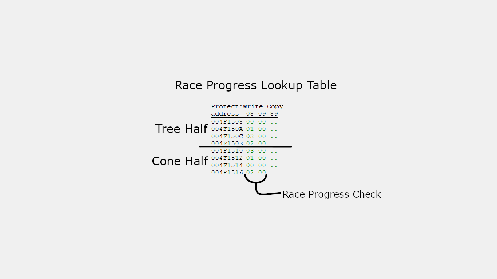
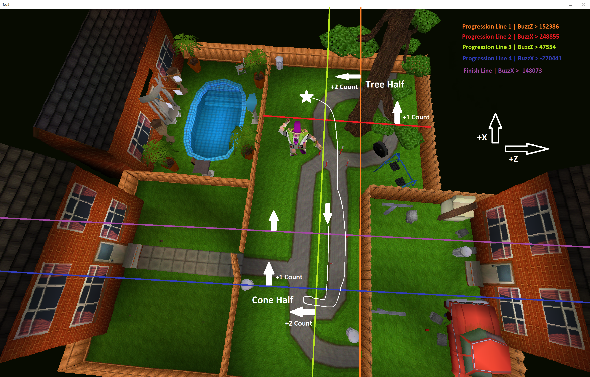

# No full write up available at this time, but...
## Here are some related discord posts

I took a quick look at AN Race, but unfortunately it also looks like the programmers made it fairly hard to cheese. Without doing a full write-up, the game basically tracks the area of the map Buzz is in (not related to zones). Each lap consists of 8 levels of progress (tracked at 0x0052f6b0). To simplify things (and avoid a full write-up), these 8 progress states can be reduced to 5. The game waits to see Buzz go beyond a certain X/Z threshold, but the order in which these thresholds are crossed is important. Cross a threshold too soon, and the lap's progress won't be updated. In essence, the 5 key areas of the race need to be reached in order before crossing the finish line. The code for this is fairly straight forward. It starts at 0x00419269 and the progress lookup table is stored at 0x004f1508. In essence, without some breakthrough in movement tech, I think the current IL WR is near optimal.

To accurately explain what happened in https://discordapp.com/channels/173895538754846721/173895538754846721/982837949567733850 I will need to provide a bit more background on how races work in the game. The "areas" I mentioned before were an abstraction of what is really going on. The short of it is there are a bunch of checks based on Buzz's position. By not crossing over the last line before the finish line and then walking a specific route, the lap count is delayed.

# Lap Progress Basics
Progress through a lap is tracked by a variable referred to as: `raceProgress (@0x0052f6b0)`. This variable starts off at `0` at the beginning of a lap and is incremented by one each time lap progress is made. Once `raceProgress` has `8` and Buzz's position is acceptable (`buzzX > -0x24269`) a lap is completed; incrementing the lap counter and resetting `raceProgress`. The tracking of lap progress can be further subdivided into two halves referred to as: Tree Half and Cone Half. Tree Half consists of `raceProgress` states `0-3`. Then, once `raceProgress` has reached `4`, the Cone Half begins.

# Making Progress
In order to know when to increase `raceProgress`, the game watches Buzz's current position in `X` and `Z`. During the race, every time the level specific function referred to as: `AN_handler() @0x004190c0` is called the progress checking code (starting at `0x00419269`) is called. This "inline function" first checks to see if Buzz is in the Tree Half (`RaceProgress < 4`) or the Cone Half (`raceProgress < 8`). While the specifics of the comparisons are different, the general concept is the same. First, start with a local variable referred to as: `trackLocation (@0x004192fd)` is initialized to `0`. Then two more checks /assignments happen:
- If Buzz has crossed the Half specific `Z` threshold, increase the `trackLocation` by `1`.
- If Buzz has crossed the Half specific `X` threshold, increase the `trackLocation` by `2`.

In essence, `trackLocation` provides a way to numerically describe which quadrant of a given half of the track Buzz is currently in. In order for track progression to happen, Buzz must enter the next expected quadrant of the half of the track he is on. This check is done using what is referred to as: `raceProgressLUT (@0x004f1508)` where the current `raceProgress` is used as an index into the array/table. When the value retrieved from the `raceProgressLUT` matches `trackLocation` `raceProgress` is incremented by one. The image below shows the `trackLocation`s required for each section of the race.

# Delayed Lap Increment
In the video linked above, the lap count is delayed well past when Buzz has crossed the finish line (`buzzZ > -148073`). So, how is this possible? It's because Buzz never makes it into the "final quadrant" of the Cone Half. Referring to the image below, Buzz never crosses progression line 4 while _also_ on the other side of progression line 3. Crossing over progression line 3 brings his `raceProgress` up to 7 but `raceProgress` must be 8 before a lap is completed. As long as Buzz doesn't cross back over progression line 3 and 4 his progress will remain the same. Looking again at the map, Buzz's route is plotted out demonstrating how the delay lap count was achieved.

# Conclusion
Unfortunately, while this is certainly interesting behavior, it is unlikely to be useful in a speedrun. Buzz must travel the same distance regardless of when the lap is counted. Additionally, if Buzz travels past progression line 2 _before_ increasing the lap counter, `raceProgress` will remain at `0` forcing Buzz to back track to the other side of progression line 2 before proceeding on like normal.